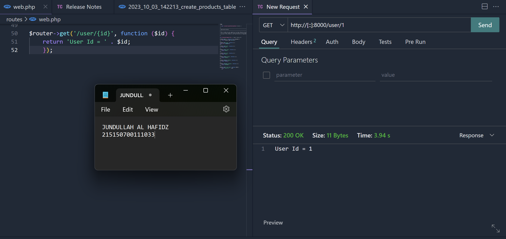
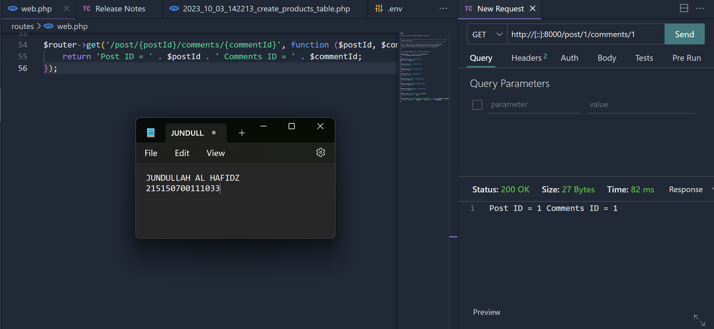
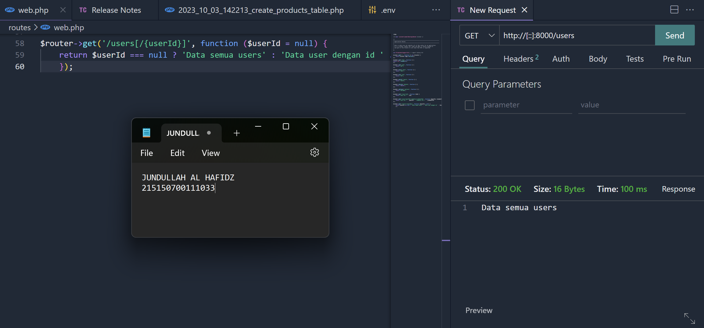
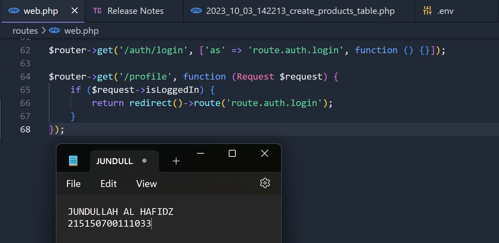
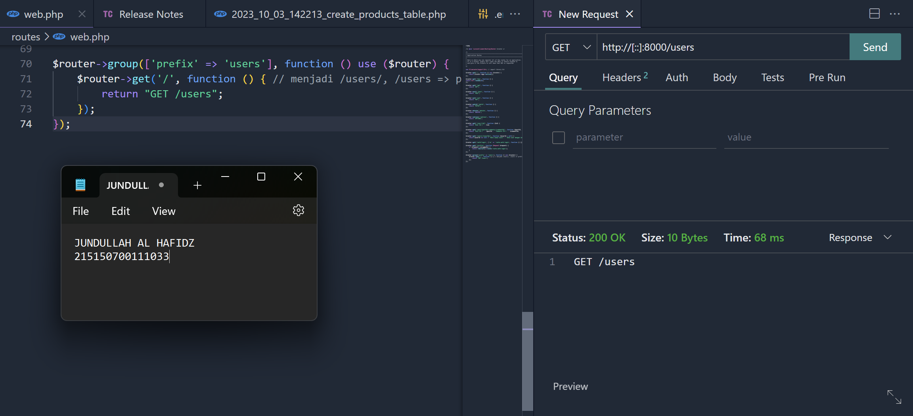
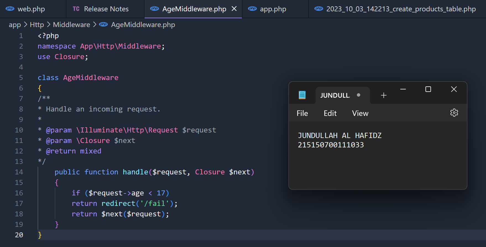
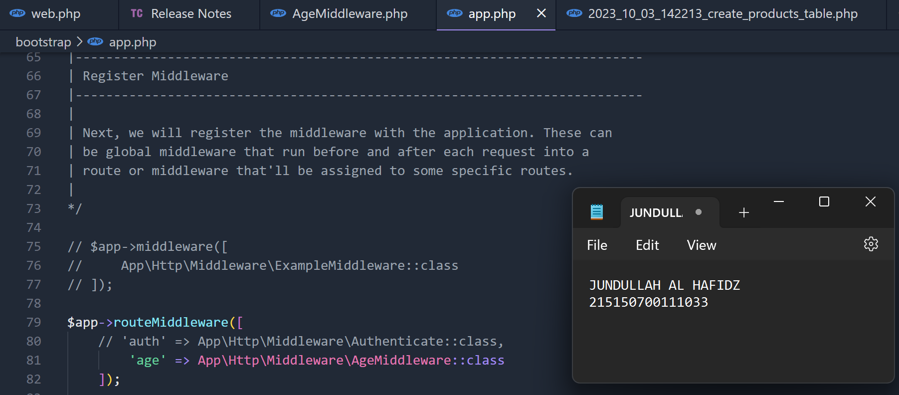
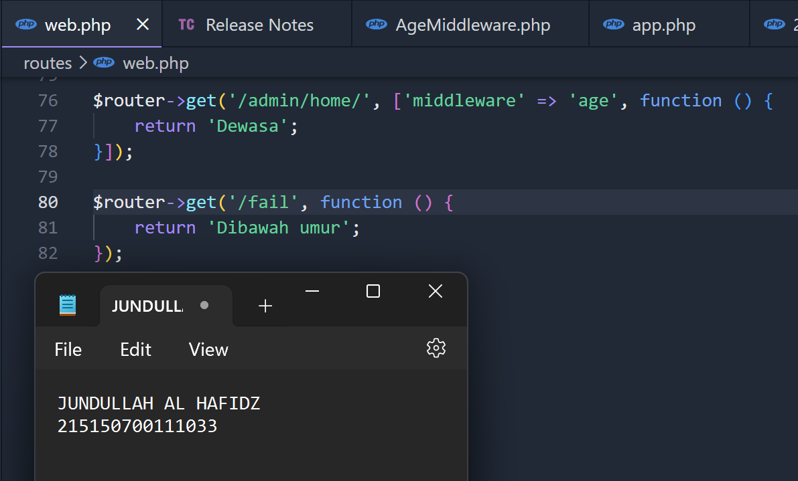

Jundullah Al Hafidz - 215150700111033

# Langkah Percobaan
### Dynamic Route
Dynamic route adalah route yang dapat berubah-ubah, seperti ketika kita membuka halaman web, kita melihat `/user/1` atau `/user/2`, hal ini dinamakan dynamic route. kita dapat menggunkaan syntax berikut ini untuk mengatur dynamic route lalu melakukan request  
  

Kita juga dapat membuat dynamic route yang tidak hanya terbatas satu variabel saja. Kita dapat menambahkan sebanyak yang diperlukan seperti pada syntax berikut lalu melakukan request  
  

Kita juga dapat membuat optional route pada dynamic route. Optional route tidak mengharuskan kita untuk memberi variabel ketika memanggil endpoint. Contoh optional route seperti syntax berikut lalu melakukan request  
  

### Aliases Route
Aliases route digunakan untuk memberi nama route yang telah kita buat, hal ini memudahkan ketika memanggil route pada sebuah aplikasi. Kita dapat menggunakan syntax berikut ini untuk membuat aliases route.
  

### Group Route
Group route memudahkan kita saat penulisan kode route pada file web.php. Kita dapat menggunkaan syntax berikut ini unuk membuat group route lalu melakukan request.
  

### Middleware
Middleware digunakan untuk memfilter permintaan HTTP yang masuk pada aplikasi kita. Middleware adalah penengah antara komunikasi aplikasi dan client. Untuk membuat middleware, kita menambahkan file pada folder `app/http/Middleware`. Kita menambahakn file AgeMiddleware seperti dibawah ini.
  

Kemudian, kita mendaftarkan AgeMidleware pada file `bootstrap/app.php` seperti dibawah ini
  

Terakhir, kita menambahkan middleware pada routes menambahkan opsi
middleware pada salah satu route seperti dibawah ini lalu melakukan request
  
