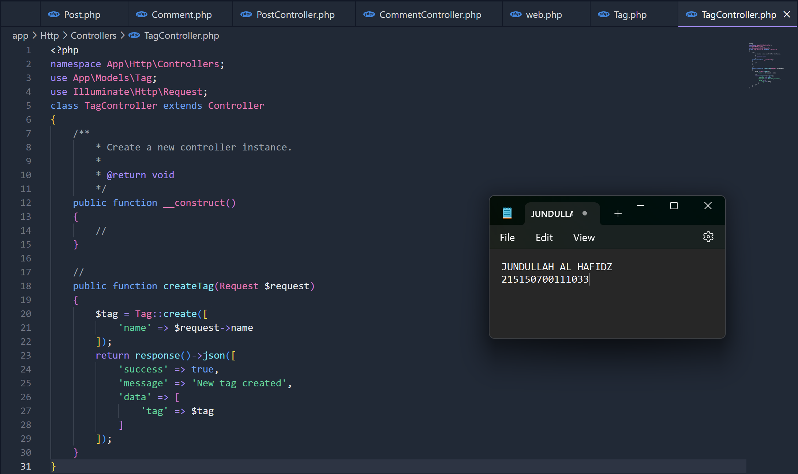

Jundullah Al Hafidz - 215150700111033

### Relasi

Hubungan antar tabel yang dilakukan dengan pencocokan primary key dengan foreign key untuk mengombinasikan data dari satu tabel dengan tabel lainnya.

### Foreign Key

Properti yang digunakan untuk menandai hubungan dua tabel atau lebih. Foreign key pada tabel anak (child) akan menunjuk tabel induk (parent) yang menjadi referensinya (reference).

### One-to-Many

Relasi yang menunjukkan hubungan antar tabel dimana baris pada tabel induk dapat terhubung dengan satu atau lebih baris di tabel anak. Sementara baris pada tabel anak hanya dapat terhubung dengan satu baris di tabel induk.

Contoh penerapan one-to-many

- Satu tutorial dapat memiliki banyak komentar, namun satu komentar hanya dapat berada di satu tutorial
- Satu dosbing dapat memiliki banyak mahasiswa, namun mahasiswa hanya dapat dibimbing satu dosen

### Many-to-Many

Relasi yang menunjukkan hubungan antar tabel dimana baris pada tabel induk dapat terhubung dengan satu atau lebih baris di tabel anak. Berlaku sebaliknya pada tabel anak yang dapat terhubung dengan satu atau lebih baris di tabel induk.

Contoh penerapan many-to-many

- Satu mahasiswa dapat mengambil banyak mata kuliah, namun satu mata kuliah dapat diambil banyak mahasiswa
- Postingan dapat memiliki banyak tag, namun satu tag dapat dimiliki banyak postingan.

Kombinasi baris pada relasi many-to-many diatur dengan junction table.

### Junction Table

Tabel yang digunakan untuk mengatur kombinasi baris pada relasi many-to-many. Junction table berisi foreign key dari kedua tabel yang memiliki relasi many-to-many.

## 📒Langkah Percobaan

### Pembuatan Tabel

Berikut ini tabel yang akan digunakan pada praktikum kali ini
posts | comments | tags | post_tag |
--- | --- | --- | --- |
id | id | id | postId |
content (STRING) | review (STRING) | name | tagId |

1. Memastikan server database aktif dan membuat database dengan nama `lumenapi` 
      
2. Mengubah konfigurasi database pada file `.env`  
      
3. Menghidupkan library bawaan lumen dengan membuka file `app.php` pada folder `boostrapt`  
   
4. Menjalankan Command untuk membuat file migration
   
5. Mengubah fungsi `up()` pada file `create_post_table`
6. Mengubah fungsi `up()` pada file `create_comment_table`
7. Mengubah fungsi `up()` pada file `create_tags_table`
8. Mengubah fungsi `up()` pada file `create_post_tag_table`
   
10. Menjalankan command `php artisan migrate`
   

### Pembuatan Model

1. Membuat file dengan nama `Post.php` dan mengisi dengan baris kode berikut  
   
2. Membuat file dengan nama `Comment.php` dan mengisi dengan baris kode berikut  
   
3. Membuat file dengan nama `Tag.php` dan mengisi dengan baris kode berikut  
   

### Relasi One-to-Many

1. Tambahkan fungsi `comments()` pada file Post.php 
   
2. Tambahkan fungsi `post()` dan atribut postId pada `$fillable` pada file `Comment.php` 
   
3. Membuat file `PostController.php` dan isilah dengan baris kode berikut  
   
4. Membuat file `CommentController.php` dan isilah dengan baris kode berikut  
   
5. Tambahkan baris berikut pada `routes/web.php`  
   
6. Membuat satu post menggunakan Postman  
   
7. Membuat satu comment menggunakan Postman  
   
8. Menampilkan post menggunakan Postman  
   

### Relasi Many to Many

1. Menambahkan fungsi `tags()` pada file Post.php 
   
2. Menambahkan fungsi `posts()` pada file Tag.php 
   
3. Membuat file `TagController.php` dan isilah dengan baris kode berikut  
   
4. Menambahkan fungsi `addTag` dan response tags pada `PostController.php`  
   
5. Menambahkan baris berikut pada `routes/web.php`  
   
6. Membuat satu tag menggunakan Postman  
   
7. Menambahkan tag `jadul` pada post `disana engkau berdua`  
   
8. Menampilkan post `disana engkau berdua`” menggunakan Postman  
   
9. Membuat postingan `tanpamu apa artinya` menggunakan Postman  
   
10. Menambahkan tag `jadul` pada postingan `tanpamu apa artinya`  
    
11. Membuat tag `lagu` menggunakan Postman  
    
12. Menambahkan tag `lagu` pada postingan `tanpamu apa artinya`  
    
13. Menampilkan post pertama  
    
14. Menampilkan post kedua  
    
