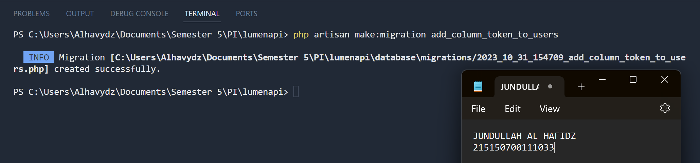

Jundullah Al Hafidz - 215150700111033

### Authentication

Otentifikasi adalah proses untuk mengenali identitas dengan mekanisme pengasosiasian permintaan yang masuk dengan satu set kredensial pengidentifikasi. Kredensial yang diberikan akan dibandingkan dengan database informasi pengguna yang berwenang di dalam sistem operasi lokal atau server otentifikasi.

### Token

Token merupakan nilai yang digunakan untuk mendapatkan akses ke sumber daya yang dibatasi secara elektronik. Penggunaan token ditujukan pada web service yang tidak menyimpan state yang berkaitan dengan penggunaan aplikasi (stateless) seperti session.

### Authorization

Authorization merupakan proses pemberian hak istimewa yang dilakukan setelah proses authentication. Setelah pengguna diidentifikasi pada proses authentication, authorization akan memberikan hak istimewa dan tindakan yang diizinkan kepada pengguna yang ditentukan.

## Langkah Percobaan

### Register

1. Memastikan terdapat tabel users yang dibuat menggunakan migration pada Bab 3 Basic Routing dan Migration. Berikut informasi kolom yang harus ada  
   
2. Memastikan terdapat model User.php yang digunakan pada Bab 5 Model, Controller dan Request-Response Handler. Berikut baris kode yang harus ada  
   
3. Membuat file `AuthController.php` dan isilah dengan baris kode berikut  
   
4. Menambahkan route `auth/register` pada routes/web.php  
   
5. Menjalankan aplikasi pada endpoint `/auth/register` beserta body data username, email, dan password  
   

### Authentication

1. Membuat fungsi `login()` pada file `AuthController.php`  
   
2. Menambahkan route `auth/login` pada routes/web.php  
   
3. Menjalankan aplikasi pada endpoint `/auth/login` dengan body berikut  
   

### Token

1. Menjalankan perintah berikut untuk membuat migrasi baru 
   
2. Menambahkan baris berikut pada migration yang baru terbuat 
   
3. Menambahkan atribut token di `$fillable` pada `User.php`  
   
4. Menambahkan baris untuk menambahkan token pada file `AuthController.php`  
   
5. Menjalankan perintah `php artisan migrate` untuk menjalankan migrasi terbaru  
   
6. Menjalankan aplikasi pada endpoint `/auth/login` dengan body berikut. Salinlah token yang didapat ke notepad  
   

### Authorization

1. Membuat file `Authorization.php` pada folder `App/Http/Middleware` dan isilah dengan baris berikut 
   
2. Menambahkan middleware yang baru dibuat pada `bootstrap/app.php` 
   
3. Membuat fungsi `home()` pada `HomeController.php`  
   
4. Menambahkan route `home` pada `route/web.php`  
   
5. Menjalankan aplikasi pada endpoint `/home` dengan melampirkan nilai token yang didapat setelah login pada header  
   
